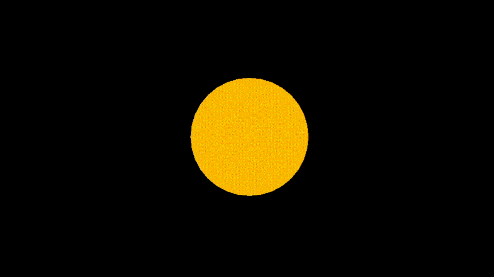
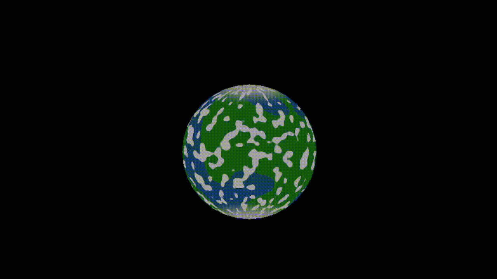
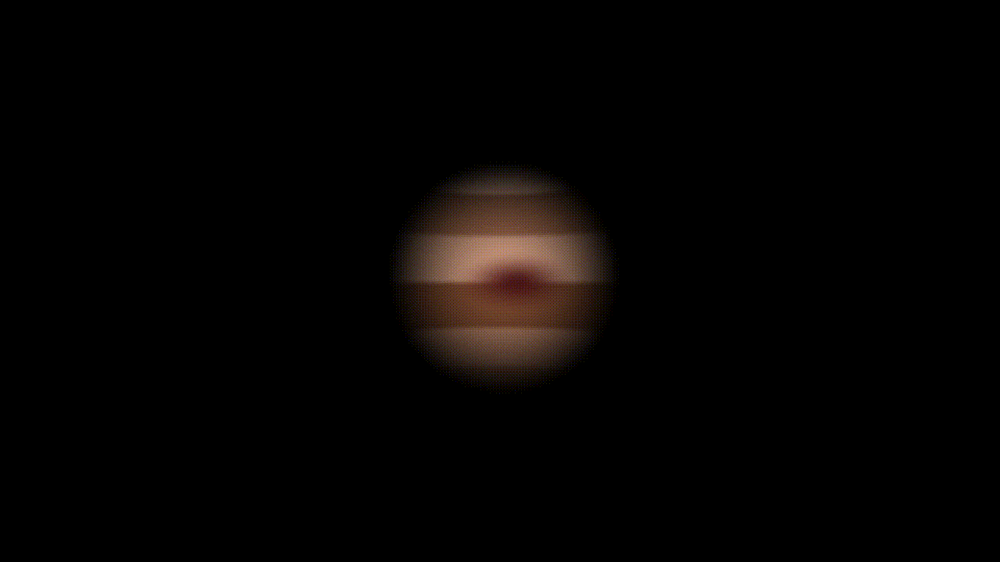
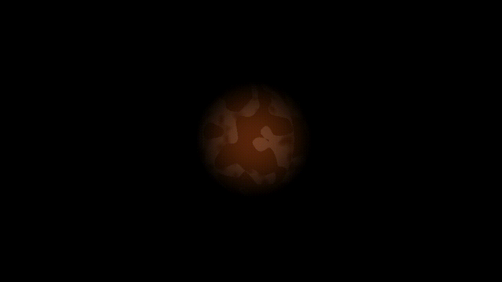
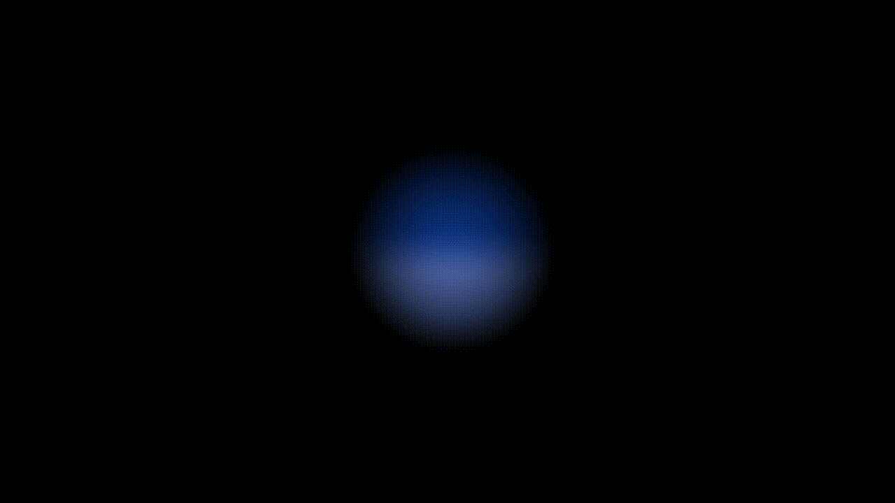
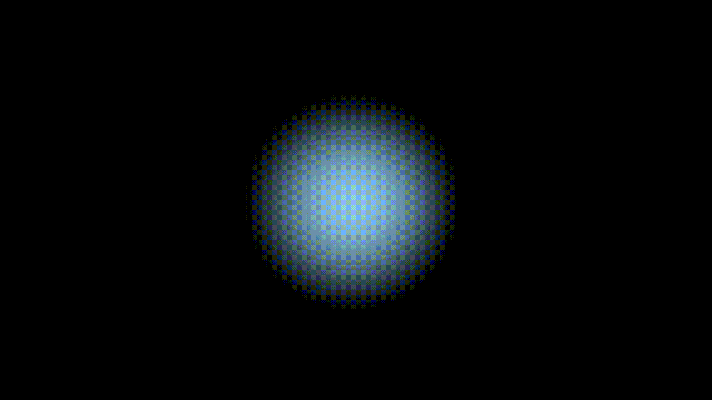

# Shaders

## Cuerpos Celestes

### Sol

- [x] Deben crear una “estrella” que va a servir como el sol de su sistema solar.

### Tierra

Para realizar la tierra, se utilizaron 4 capas de Noise, para simular el agua, tierra firme, nubes y hielo polar. Es también un planeta rocoso.
- [x] Deben crear un planeta rocoso.
- [x] Pueden suponer 10 puntos por cada “capa” del shader que afecte el color. 4 capas les daría todos los puntos.

### Jupiter

- [x] Deben crear un gigante gaseoso.

### Marte

- [x] 10 puntos por cada planeta extra que diseñen.

### Neptuno

- [x] 10 puntos por cada planeta extra que diseñen.

### Urano

- [x] 10 puntos por cada planeta extra que diseñen.